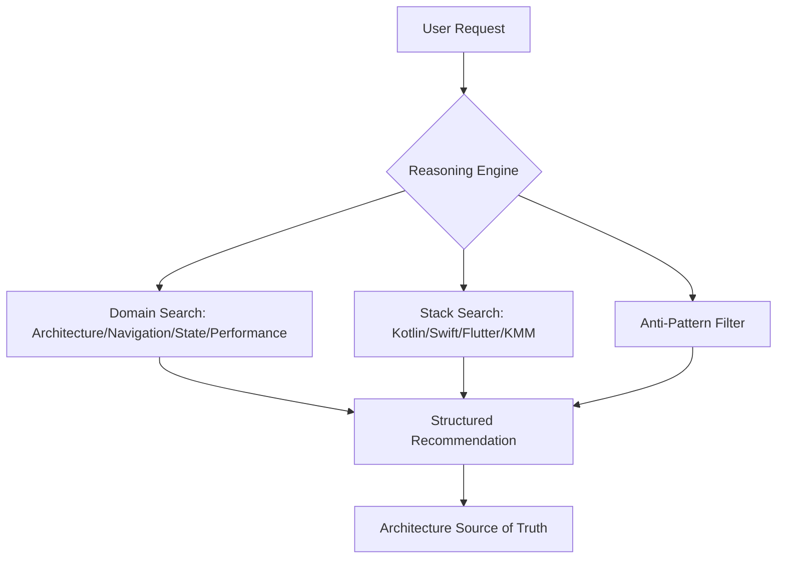

# Mobile-Native Pro Max

<p align="center">
  
  
  
  
</p>

Mobile-Native Pro Max is an AI coding-agent skill for native mobile development across Android (Kotlin/Compose), iOS (Swift/SwiftUI), and cross-platform (KMM/Flutter/Compose Multiplatform).

It follows the same pattern as UI/UX Pro Max and Backend Arch Pro Max: searchable rules, a lightweight reasoning engine, structured recommendations, and a pre-delivery checklist.

## Architecture Overview



## What It Covers

- UI Components: Bottom nav, lists, forms, cards, modals, search bars, and Material/HIG patterns.
- Navigation: Stack, tab, drawer, deep linking, auth-gated flows, and predictive back.
- Architecture: MVVM, MVI, Clean Architecture, modular design, and repository pattern.
- State Management: ViewModel, StateFlow, Combine, side effects, pagination, and offline sync.
- Performance: Startup, memory, rendering (60fps), battery, image loading, and Compose optimization.
- Testing: Unit, UI, screenshot, accessibility, performance benchmarks, and leak detection.
- Platform APIs: Camera, location, notifications, biometrics, BLE, widgets, and in-app purchases.
- Build & Deploy: Play Store, App Store, Fastlane, code signing, feature flags, and crash monitoring.
- Anti-patterns: Main-thread network, god activities, leaked listeners, missing accessibility, and more.
- Stacks: Kotlin, Swift, Java, Objective-C, Dart, Compose, SwiftUI, UIKit, Flutter, KMM, Room, CoreData, SQLDelight, Retrofit, Ktor, Hilt, Koin, Firebase, Fastlane, Gradle, Xcode, Coil, and more.

## Dataset

Current dataset size: **157+ rows**.

| File | Rows |
| --- | ---: |
| `ui_components.csv` | 14 |
| `navigation_patterns.csv` | 12 |
| `architecture_patterns.csv` | 12 |
| `state_management.csv` | 12 |
| `performance_optimization.csv` | 12 |
| `testing_strategies.csv` | 12 |
| `platform_apis.csv` | 12 |
| `build_deployment.csv` | 12 |
| `anti_patterns.csv` | 25 |
| `stacks.csv` | 24 |

Validate the CSV files:

```powershell
python src\mobile-native-pro-max\data\_sync_all.py
```

## Usage

Search for patterns and generate architectures directly from the CLI:

```bash
# Generate app architecture recommendation
npx mobile-native-pro-max search "e-commerce app kotlin compose" --architecture

# Search specific domains
npx mobile-native-pro-max search "bottom navigation setup" --domain navigation-patterns
npx mobile-native-pro-max search "mvvm clean architecture" --domain architecture-patterns
npx mobile-native-pro-max search "compose performance recomposition" --domain performance-optimization

# Filter by stack
npx mobile-native-pro-max search "offline first database" --stack kotlin
npx mobile-native-pro-max search "swiftui navigation" --stack swift
npx mobile-native-pro-max search "bloc state management" --stack flutter
```

## CLI Installer

Install the skill into your project directory:

```bash
npx mobile-native-pro-max init

# Or specify platform explicitly
npx mobile-native-pro-max init --ai cursor
npx mobile-native-pro-max init --ai claude
npx mobile-native-pro-max init --ai codex
npx mobile-native-pro-max init --ai windsurf
npx mobile-native-pro-max init --ai antigravity
```

### CLI Arguments

| Argument | Description |
| --- | --- |
| `--ai <platform>` | The platform you are using (e.g., `claude`, `cursor`, `windsurf`, `codex`). Auto-detected if omitted. |
| `--target <dir>` | The destination project directory. Defaults to current directory (`.`). |
| `--force` | Overwrites existing files if the skill was already installed. |

Supported platform templates currently include Codex, Claude, Cursor, Windsurf, and Antigravity.

## Skill Structure

```text
mobile-native-pro-max-skill/
|-- SKILL.md
|-- README.md
|-- skill.json
|-- agents/openai.yaml
|-- cli/
|-- docs/REFERENCE.md
|-- examples/
|-- scripts/search.py
|-- templates/platforms/
|-- tests/test_search.py
`-- src/mobile-native-pro-max/data/
```

## Validation

```powershell
$env:PYTHONDONTWRITEBYTECODE='1'; python src\mobile-native-pro-max\data\_sync_all.py
$env:PYTHONDONTWRITEBYTECODE='1'; python -m unittest tests\test_search.py
node cli\bin\mobile-native-pro-max.js list
node cli\bin\mobile-native-pro-max.js init --ai codex --target . --dry-run
npm --prefix cli pack --dry-run
```

## Release

- Current release version: `0.1.2`.
- Tag format: `v*` (example: `v0.1.2`).
- CI release workflow file: `.github/workflows/release.yml`.
- npm publish requires repository secret `NPM_TOKEN`.
- GitHub Release notes are sourced from `RELEASE_NOTES.md`.
